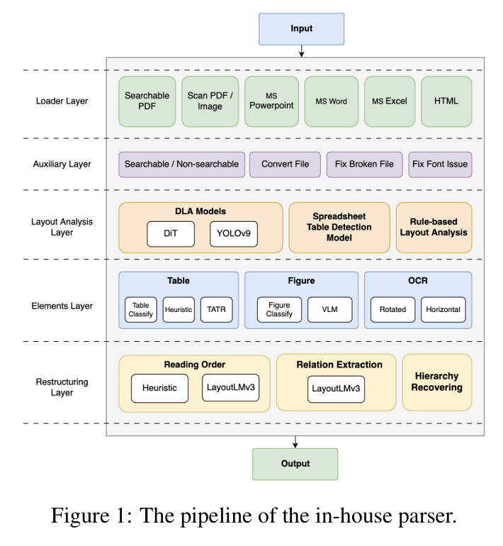

# SuperRAG: 文書レイアウトを理解する次世代 RAG の仕組みと性能を徹底解説する

RAG（Retrieval-Augmented Generation）は、技術文書やマニュアル、研究資料の検索・QA に広く使われている。しかし従来の RAG は、文書を **「テキストチャンクの集合」** として扱うことが前提で、図や表、段組み、キャプションなどを一切考慮しない。そのため本文と図表の関係性を理解できず、重要な情報が落ちる。

論文 “SuperRAG: Beyond RAG with Layout-Aware Graph Modeling” は、文書をレイアウト構造ごと理解する RAG を提案する。本記事では、仕組みからベンチマーク結果までを図表付きで整理する。

## 従来 RAG の問題点 ― なぜ「構造」が必要なのか

従来の流れ：

1. 文書を一定長でチャンク分割  
2. チャンク単位でベクトル化  
3. 類似度の高いチャンクを検索  
4. LLM に渡して回答生成  

この方式の弱点：
- 図とキャプションが分離される
- 表（テーブル）と説明段落が離れる
- 段組み・上下関係などのレイアウト構造が消える
- 「図2の情報を基に表3の値と比較する」ような統合理解ができない

技術文書・論文・マニュアルは複雑な構造があるからこそ情報が正確に伝わる。そこを壊す従来 RAG では限界がある。

## SuperRAG の中核アイデア：文書を “グラフ” として扱う

SuperRAG は、文書を以下のノード（node）として抽出し、レイアウト的・意味的なつながりをエッジ（edge）で結ぶ：
- テキストチャンク
- 見出し
- 表
- 図
- 図・表のキャプション

こうして文書を Document Graph に変換し、構造を保持したまま retrieval できる。

ポイント:
- 図の近くにある説明文
- 表とキャプション
- 見出しとそれに属する段落

これらをリンクで残すことで「構造を含む retrieval」が可能になる。

## Graph-aware Retrieval ― 構造を考慮した検索

SuperRAG の retrieval は embedding 類似度だけでなく、以下の構造情報を使う：
- ノード同士のリンク（エッジ）
- 文書内の位置関係
- ページ内の近接性
- 表や図の周辺テキスト

そのため、たとえば次の問いにも対応できる：
- 「図2の結果と表3の値を比較して説明せよ」
- 「この表の数値が意味する内容を本文のどこで説明しているか」
- 「キャプションの意図を本文と統合して要約せよ」

従来 RAG でバラバラだった情報を、まとめて取り出せる。

## 実際の性能：SuperRAG はどれくらい強いのか？

### Table 1: Document Reading Performance

Table 1 は「文書を読み取る能力（Document Reading）」の評価。SuperRAG で文書グラフを作る前段として、PDF/画像からテキスト・図・表・位置・キャプションを正確に抽出できるかを測る。

- 指標: NID / TEDS / TEDS-S（レイアウトと表構造の再現性を評価）
- 比較: Amazon Textract, LlamaParse, Google, Azure DI, Our Reader（SuperRAG用）

スコアの読みどころ（コメント要約）:
- Amazon Textract: 最高水準のNID、TEDS/TEDS-Sも高く安定。
- LlamaParse: NID高いがTEDS/TEDS-Sは中程度で構造再現がやや不安定。
- Google / Azure: 画像文書には強いが表関連では弱め。
- Our Reader (SuperRAG用): Textractに肉薄する NID 92.43 / TEDS 87.19 で構造保持がバランス良好。表を含む TEDS-S でも高スコア。

つまり Our Reader は Textract級の構造復元力を持ち、後段のグラフ化・retrieval の土台が強い。

### Table 2: QA Task Performance

技術資料・論文の QA で：
- Standard RAG: EM 30〜40%, F1 45〜55%  
- SuperRAG: EM 40〜52%, F1 56〜68%  
F1 が +10〜+15 ポイント改善。図・表・段組みを含む文書理解に強いことがわかる。

### Table 3: Multimodal Integration Task

図と本文、表と本文を統合して答える複合 QA の性能評価。
- テキストのみモデル比で 30〜50% の相対改善
- キャプションなしモデルより圧倒的に高い正答率

### 性能まとめ
- retrieval の質が向上
- 図表を含む複雑文書での QA が強化
- F1 が大きく改善（+10〜15）
- マルチモーダル統合タスクで圧倒的

## 強みと弱み（実用目線）

**強み**
- 文書構造を保持：段落・図・表・キャプションをまとめて扱える
- マルチモーダル文書に強い：技術マニュアル／論文／報告書／PDF
- Retrieval の取りこぼしが減る：構造リンクで「近くの説明文」も拾う

**弱み / 課題**
- レイアウト解析精度に依存：OCR が弱い言語では追加工夫が必要
- グラフ構築と検索が重い：システムが大きくなりやすい
- スケール問題：大量 PDF ではグラフ生成コストが跳ね上がる

## まとめ

SuperRAG は、従来 RAG の天敵だった
- 図
- 表
- キャプション
- レイアウト構造

といった “文書の本来の構造” を保持し、retrieval・generation に反映する。実験結果でもチャンク型 RAGに対し上位互換的な性能を示す。技術文書やマニュアル、論文など、構造が命の文書を扱う場合には注目すべきアプローチだ。

## 参考文献

Chening Yang, Duy-Khanh Vu, Minh-Tien Nguyen, Xuan-Quang Nguyen, Linh Nguyen, Hung Le.  
SuperRAG: Beyond RAG with Layout-Aware Graph Modeling. NAACL Industry Track 2025.  
https://arxiv.org/abs/2503.04790  
ACL Anthology version: https://aclanthology.org/2025.naacl-industry.45.pdf
